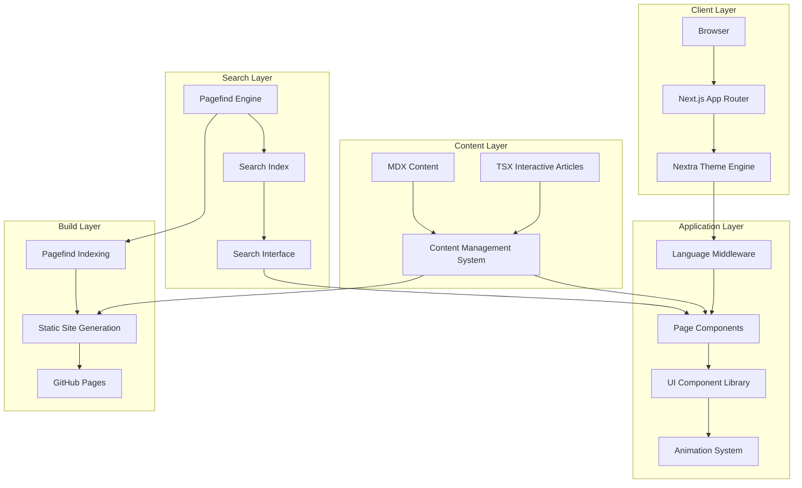
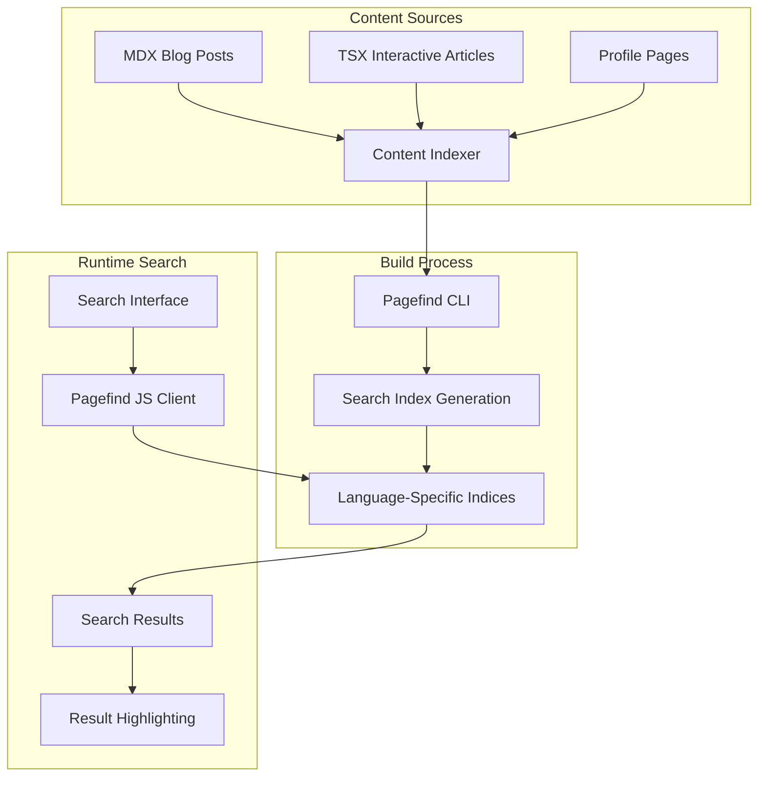
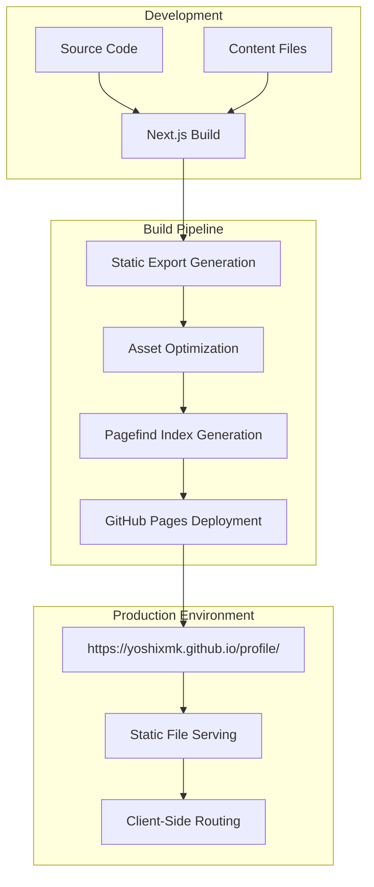
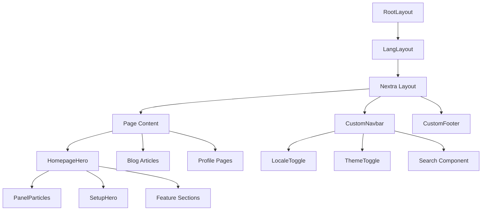

# Design Document

## Overview

This design document outlines the architecture and implementation approach for a Next.js 15 + Nextra 4 personal profile and blog website. The system leverages modern React patterns, TypeScript for type safety, and a comprehensive component-based architecture to deliver a bilingual, animated, and highly interactive user experience.

The design emphasizes performance, accessibility, and maintainability while providing rich visual effects through particle animations and smooth transitions. The content management system is built around MDX and TSX files, enabling both traditional blog posts and interactive presentation-style articles.

## Architecture

### High-Level Architecture



### Technology Stack Integration

The architecture integrates multiple modern technologies:

- **Next.js 15 App Router**: Provides the foundational routing and server-side rendering capabilities
- **Nextra 4**: Handles MDX processing and documentation-style layouts
- **Tailwind CSS 4**: Delivers utility-first styling with CSS variables for theming
- **Framer Motion**: Powers smooth animations and transitions
- **tsparticles**: Creates interactive particle background effects
- **next-themes**: Manages dark/light mode switching with system preference detection
- **Pagefind**: Provides static search functionality with multilingual indexing and real-time search capabilities

### Search System Architecture

The search functionality is implemented using Pagefind, a static search engine that generates indices at build time:



**Design Rationale**: Pagefind provides client-side search without requiring a backend server, making it ideal for static site deployment on GitHub Pages. The build-time indexing ensures fast search performance while supporting multilingual content with proper language separation.

### Deployment Architecture

The system uses a static export approach optimized for GitHub Pages with specific configuration requirements:



**GitHub Pages Configuration Requirements**:

1. **Base Path Configuration**: `/profile/` base path for repository-based GitHub Pages hosting
2. **Asset Prefix**: Proper asset URL prefixing for static resource loading
3. **Trailing Slash**: Enabled for GitHub Pages routing compatibility
4. **Static Export**: Complete static file generation without server-side dependencies
5. **Search Index Integration**: Pagefind indices included in the static export

**Design Rationale**: This configuration ensures reliable deployment to GitHub Pages while maintaining full functionality including search, routing, and asset loading. The static export approach eliminates server dependencies and provides optimal performance.

## Components and Interfaces

### Core Component Hierarchy



### Component Specifications

#### Layout Components

**RootLayout Component**

- Purpose: Provides the base HTML structure and metadata
- Props: `{ children: ReactNode }`
- Responsibilities: Sets up document metadata and renders child components

**LangLayout Component**

- Purpose: Handles language-specific layouts and Nextra integration
- Props: `{ children: ReactNode, params: Promise<{ lang: I18nLangKeys }> }`
- Responsibilities:
  - Configures Nextra theme with custom navbar and footer
  - Sets up ThemeProvider for dark/light mode
  - Manages language-specific page maps and metadata

#### Interactive Components

**HomepageHero Component**

- Purpose: Renders the main landing page with animations and feature showcase
- State: Uses theme context and locale context
- Subcomponents: PanelParticles, SetupHero, Feature sections with HoverEffect
- Animation: Integrates with Framer Motion for smooth transitions

**PanelParticles Component**

- Purpose: Renders interactive particle background effects
- Configuration: Dynamic particle settings based on theme (light/dark)
- Performance: Disabled on mobile devices via CSS classes
- Integration: Uses tsparticles engine with custom configuration

#### Widget Components

**ThemeToggle Component**

- Purpose: Provides quick dark/light mode switching
- State: Integrates with nextra-theme-docs useTheme hook
- UI: Toggle button with sun/moon icons
- Persistence: Automatically saves preference to localStorage

**LocaleToggle Component**

- Purpose: Enables language switching between Japanese and English
- State: Uses custom useLocale hook and Next.js navigation
- Behavior: Preserves scroll position during language changes
- Persistence: Sets NEXT_LOCALE cookie with one-year expiration

**SearchInterface Component**

- Purpose: Provides static search functionality across all content
- Integration: Uses Pagefind JS client for real-time search
- Features: Multilingual search with result highlighting and snippets
- Performance: Client-side search with pre-built indices for fast results

### Interface Definitions

#### Internationalization Interfaces

```typescript
type I18nLangKeys = 'ja' | 'en'

interface I18nLangAsyncProps {
  lang: I18nLangKeys
}

interface LocaleContext {
  currentLocale: I18nLangKeys
  t: <K extends LocaleKeys>(key: K, withData?: Record<string, any>) => LocalizedValue<AllLocales, K>
}
```

#### Content Management Interfaces

```typescript
interface BlogArticle {
  title: string
  content: string
  frontMatter: {
    title: string
    author?: string
    published?: string
  }
}

interface MetaRecord {
  [key: string]: {
    type: 'page' | 'separator'
    title?: string | ReactNode
    display?: 'hidden' | 'children'
    theme?: {
      timestamp?: boolean
      layout?: 'default' | 'full'
      toc?: boolean
      navbar?: boolean
    }
  }
}
```

#### Animation System Interfaces

```typescript
interface ParticleOptions {
  fpsLimit: number
  interactivity: {
    events: {
      onHover: {
        enable: boolean
        mode: string
      }
    }
  }
  particles: {
    color: { value: string }
    links: {
      color: { value: string }
      distance: number
      enable: boolean
      opacity: number
      width: number
    }
    move: {
      direction: string
      enable: boolean
      speed: number
    }
    number: {
      density: { enable: boolean }
      value: number
    }
    opacity: { value: number }
    size: { value: { min: number, max: number } }
  }
}
```

#### Search System Interfaces

```typescript
interface SearchResult {
  id: string
  url: string
  title: string
  excerpt: string
  content: string
  language: I18nLangKeys
  meta: {
    word_count: number
    filters: Record<string, string>
  }
}

interface SearchOptions {
  language?: I18nLangKeys
  limit?: number
  excerptLength?: number
  highlightParam?: string
}

interface PagefindInstance {
  search: (query: string, options?: SearchOptions) => Promise<SearchResult[]>
  filters: () => Promise<Record<string, string[]>>
  init: () => Promise<void>
}
```

## Data Models

### Content Structure Model

The content management system organizes files in a hierarchical structure following the development guidelines:

```
src/content/
├── ja/                          # Japanese content
│   ├── _meta.tsx               # Navigation configuration
│   ├── index.mdx               # Homepage content
│   ├── introduction.mdx        # Profile/career page
│   ├── site-structure.mdx      # Site structure documentation
│   └── blog/                   # Blog articles
│       ├── _meta.tsx           # Blog navigation
│       ├── index.mdx           # Blog index
│       ├── *.md                # Standard blog posts (numbered: 001-title.md)
│       └── *.tsx               # Interactive presentations
└── en/                         # English content (mirrors ja structure)
```

**Design Rationale**: This structure ensures consistent bilingual content management with clear separation between languages while maintaining identical navigation structures. The numbered blog post convention (001-title.md) provides clear ordering and organization.

### Configuration Data Models

#### Next.js Configuration Model

```typescript
interface NextConfig {
  images: { unoptimized: boolean }
  eslint: { ignoreDuringBuilds: boolean }
  reactStrictMode: boolean
  output: 'export'                    // Required for GitHub Pages
  assetPrefix: string                 // GitHub Pages base path
  basePath: string                    // Repository path (/profile/)
  trailingSlash: boolean             // GitHub Pages compatibility
}
```

**Design Rationale**: The configuration is optimized for GitHub Pages deployment with static export, proper asset prefixing, and trailing slash handling for reliable routing on static hosting.

#### Nextra Configuration Model

```typescript
interface NextraConfig {
  defaultShowCopyCode: boolean
  unstable_shouldAddLocaleToLinks: boolean
}
```

#### Package Management Model

```typescript
interface PackageConfig {
  packageManager: 'pnpm'             // Enforced package manager
  scripts: {
    dev: 'next dev'
    build: 'next build'
    pagefind: 'pagefind --site out'   // Search index generation
  }
  dependencies: {
    next: '^15.0.0'
    nextra: '^4.0.0'
    'nextra-theme-docs': '^4.0.0'
    typescript: '^5.0.0'
    pagefind: '^1.0.0'               // Static search engine
  }
}
```

**Design Rationale**: pnpm is enforced for consistent dependency management and faster installs. The build process includes automatic search index generation for optimal user experience. Multiple script aliases provide flexibility for different deployment scenarios.

### Theme Data Model

The theme system uses a structured approach to manage color schemes and visual preferences:

```typescript
interface ThemeConfig {
  attribute: 'class'
  defaultTheme: 'system' | 'light' | 'dark'
  enableSystem: boolean
  storageKey: string
  disableTransitionOnChange: boolean
}

interface ThemeColors {
  light: {
    particles: string
    particleLinks: string
    particleOpacity: number
  }
  dark: {
    particles: string
    particleLinks: string
    particleOpacity: number
  }
}
```

### Performance Optimization Strategy

The architecture implements multiple performance optimization techniques:

#### Code Splitting and Lazy Loading

- **Component-Level Splitting**: Heavy components like particle systems are dynamically imported
- **Route-Level Splitting**: Next.js App Router automatically splits routes for optimal loading
- **Asset Optimization**: Images and static assets are optimized during build process

#### Core Web Vitals Optimization

```typescript
interface PerformanceTargets {
  LCP: '<2.5s'    // Largest Contentful Paint
  FID: '<100ms'   // First Input Delay  
  CLS: '<0.1'     // Cumulative Layout Shift
}
```

**Design Rationale**: Performance targets align with Google's Core Web Vitals recommendations to ensure optimal user experience across all devices and connection speeds.

#### Mobile Performance Considerations

- **Particle System**: Automatically disabled on mobile devices to preserve battery and performance
- **Image Optimization**: Next.js Image component with responsive sizing and lazy loading
- **Bundle Size**: Minimal dependencies and tree-shaking to reduce initial load time

**Design Rationale**: Mobile-first performance approach ensures the website remains accessible and fast on lower-powered devices while providing enhanced experiences on desktop.

### Accessibility Architecture

The accessibility system is built into every component and interaction to ensure WCAG 2.1 AA compliance:

```mermaid
graph TB
    subgraph "Semantic Structure"
        A[HTML5 Landmarks] --> B[Heading Hierarchy]
        B --> C[Navigation Structure]
        C --> D[Content Organization]
    end

    subgraph "Keyboard Navigation"
        E[Focus Management] --> F[Tab Order]
        F --> G[Skip Links]
        G --> H[Keyboard Shortcuts]
    end

    subgraph "Screen Reader Support"
        I[ARIA Labels] --> J[Alt Text]
        J --> K[Live Regions]
        K --> L[Role Attributes]
    end

    subgraph "Visual Accessibility"
        M[Color Contrast] --> N[Focus Indicators]
        N --> O[Text Scaling]
        O --> P[Motion Preferences]
    end
```



**Accessibility Design Principles**:

1. **Semantic HTML**: Proper use of HTML5 landmarks, headings, and semantic elements
2. **Keyboard Navigation**: Full keyboard accessibility with logical tab order and focus management
3. **Screen Reader Compatibility**: Comprehensive ARIA labels, alt text, and live regions
4. **Visual Accessibility**: High contrast ratios, visible focus indicators, and respect for motion preferences
5. **Progressive Enhancement**: Core functionality works without JavaScript or CSS

**Design Rationale**: Accessibility is integrated at the architectural level rather than added as an afterthought, ensuring consistent and comprehensive support across all components and interactions.

### Internationalization Data Model

Language-specific content is structured as nested objects supporting interpolation:

```typescript
interface LocaleData {
  systemTitle: string
  banner: {
    title: string
    more: string
  }
  firstName: string
  lastName: string
  badgeTitle: string
  company: string
  companyName: string
  featureList: Array<{
    title: string
    description: string
  }>
  faqs: Array<{
    question: string
    answer: string
  }>
}
```

**Design Rationale**: Nested structure allows for organized translation management while supporting dynamic content interpolation for personalized user experiences.

## Error Handling

### Client-Side Error Boundaries

The application implements comprehensive error handling at multiple levels:

#### Component-Level Error Handling

**Particle System Error Handling**

- Graceful degradation when WebGL is not supported
- Fallback to CSS animations if tsparticles fails to initialize
- Performance monitoring to disable particles on low-end devices

**Content Loading Error Handling**

- MDX parsing error boundaries with user-friendly error messages
- Fallback content when language-specific pages are missing
- Automatic retry mechanisms for failed content loads

#### Navigation Error Handling

**Language Switching Errors**

- Fallback to default language if target language content is unavailable
- Preservation of user context during error recovery
- Cookie handling errors with localStorage fallback

**Routing Error Handling**

- 404 page handling with language-appropriate content
- Middleware error recovery with default routing
- Search functionality error handling with graceful degradation

### Development Environment Error Handling

**TypeScript Integration**

- Strict mode enforcement with comprehensive type checking
- ESLint integration with @antfu/eslint-config for consistent code quality
- Real-time error detection during development with Next.js Fast Refresh

**Build Process Error Handling**

- Comprehensive error reporting during static export generation
- Asset optimization error recovery with fallback strategies
- Search index generation validation with build failure on errors

### Build-Time Error Handling

**Content Validation**

- MDX syntax validation during build process
- Missing translation detection and warnings
- Asset optimization error handling with fallbacks

**Deployment Error Handling**

- GitHub Pages deployment validation
- Asset path verification for production builds
- Search index generation error recovery

**Design Rationale**: Multi-layered error handling ensures reliable builds and deployments while providing clear feedback for content creators and developers.

## Testing Strategy

### Dual Testing Approach

The testing strategy combines unit tests for specific functionality with property-based tests for comprehensive coverage across different inputs and configurations.

#### Unit Testing Focus Areas

**Component Integration Tests**

- Theme switching functionality with localStorage persistence
- Language switching with cookie management and scroll preservation
- Particle animation initialization and theme adaptation
- Content rendering for both MDX and TSX formats

**Navigation and Routing Tests**

- Middleware language detection and redirection
- URL generation for different locales
- Page metadata generation for SEO

**Error Condition Tests**

- Missing content file handling
- Invalid language parameter handling
- Theme system fallback behavior
- Search system error recovery

#### Property-Based Testing Configuration

Property tests will use **fast-check** for TypeScript/JavaScript property-based testing with minimum 100 iterations per test. Each property test will be tagged with the format:

**Feature: nextjs-nextra-profile-website, Property {number}: {property_text}**

**Property Test Areas**

- Content management system behavior across all valid content structures
- Theme system consistency across all supported themes and devices
- Internationalization system behavior across all supported locales
- Animation system performance across different device capabilities

**Testing Infrastructure**

- Jest for unit testing framework
- React Testing Library for component testing
- fast-check for property-based testing
- Playwright for end-to-end testing of deployment builds

## Correctness Properties

_A property is a characteristic or behavior that should hold true across all valid executions of a system—essentially, a formal statement about what the system should do. Properties serve as the bridge between human-readable specifications and machine-verifiable correctness guarantees._

Based on the prework analysis and property reflection, the following correctness properties ensure the system behaves correctly across all valid inputs and configurations:

### Property 1: Locale System Consistency

_For any_ user browser configuration and website state, when the locale system processes language preferences, it should correctly detect, redirect, and persist the appropriate language while preserving user context
**Validates: Requirements 1.1, 1.2, 1.4, 1.5, 5.4**

### Property 2: Theme System Completeness

_For any_ theme mode (light, dark, system) and UI component, when theme changes occur, all visual elements should consistently reflect the new theme including particles, colors, and component styling
**Validates: Requirements 3.1, 3.2, 3.3, 3.4, 3.5**

### Property 3: Content Management System Integrity

_For any_ valid content file (MDX or TSX) and language directory, the content management system should correctly render the content with proper navigation structure and embedded component functionality
**Validates: Requirements 4.1, 4.2, 4.3, 4.4, 4.5**

### Property 4: Animation System Adaptation

_For any_ device type and theme configuration, the animation system should provide appropriate visual effects with hover animations enabled on desktop and particles disabled on mobile devices
**Validates: Requirements 2.2, 2.3, 2.5**

### Property 5: Navigation System Consistency

_For any_ page navigation and language context, the navigation system should maintain consistent header structure, proper routing, and appropriate navigation elements (breadcrumbs, TOC) based on page type
**Validates: Requirements 5.1, 5.2, 5.3, 5.5**

### Property 6: Search System Completeness

_For any_ search query and content language, the search system should return relevant results from both Japanese and English content with proper highlighting and comprehensive coverage
**Validates: Requirements 6.1, 6.2, 6.3, 6.4, 6.5**

### Property 7: Responsive Design Adaptation

_For any_ screen size and device orientation, the component library should provide appropriate layouts, typography scaling, and mobile-optimized interactions
**Validates: Requirements 7.1, 7.2, 7.4, 7.5**

### Property 8: Component Library Consistency

_For any_ UI component usage, the component library should follow shadcn/ui design patterns and provide consistent visual and interaction behaviors
**Validates: Requirements 7.3**

### Property 9: Performance Optimization

_For any_ page load and user interaction, the website should achieve optimal Core Web Vitals scores with efficient code splitting, lazy loading, and minimal bundle size
**Validates: Requirements 9.1, 9.3**

### Property 10: Accessibility Compliance

_For any_ page content and interactive element, the website should provide proper semantic HTML structure, keyboard navigation support, and appropriate ARIA labels and alt text
**Validates: Requirements 10.2, 10.4, 10.5**

### Property 11: Deployment System Reliability

_For any_ build and deployment process, the system should generate optimized static exports with proper GitHub Pages configuration and search index generation
**Validates: Requirements 8.1, 8.2, 8.3, 8.4, 8.5**

### Example-Based Properties

The following properties are best validated through specific examples rather than universal quantification:

### Example 1: Homepage Particle Initialization

When a user loads the homepage, the animation system should initialize tsparticles with proper configuration and display animated background effects
**Validates: Requirements 2.1**

### Example 2: Tech Stack Marquee Display

When displaying the tech stack section, the website should render a scrolling marquee component with technology icons and proper animation
**Validates: Requirements 2.4**

### Example 3: Search Interface Availability

When accessing any page, the search system should provide a functional search interface powered by Pagefind
**Validates: Requirements 6.1**

### Example 4: Development Environment Setup

When setting up the development environment, the system should provide TypeScript strict mode, ESLint configuration, and pnpm package management with hot reload functionality
**Validates: Requirements 9.1, 9.2, 9.3, 9.4, 9.5**

### Example 5: GitHub Pages Deployment

When deploying to production, the system should generate static exports with proper base path configuration and accessible at the target GitHub Pages URL
**Validates: Requirements 8.5**
