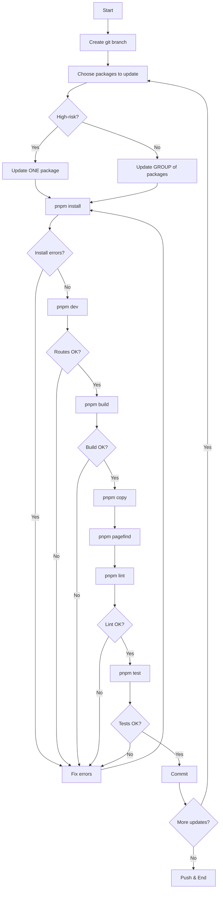

# Design Document: Library Update Process

## Overview

This is a simple, manual workflow for updating dependencies in a Next.js 15 + Nextra 4 profile website. The process is an iterative loop: update package.json → install → fix errors → verify → repeat until all updates are complete.

This is NOT a system to build, but a documented procedure to follow manually.

## Update Strategy

### High-Risk Packages (Update ONE at a time)
These are foundational libraries that affect the entire application:
- **next** - Framework core
- **react** / **react-dom** - UI library (update together)
- **nextra** / **nextra-theme-docs** - Content engine (update together)
- **tailwindcss** / **@tailwindcss/postcss** - Styling system (update together)
- **typescript** - Type system

### Low-Risk Packages (Can update in GROUPS)
These can be updated together by category:
- **UI Components**: @radix-ui/*, lucide-react, framer-motion, motion
- **Testing**: jest, @testing-library/*, fast-check
- **Linting**: eslint, @antfu/eslint-config, eslint-plugin-*
- **Build Tools**: @svgr/*, @iconify/*, postcss, sass
- **Utilities**: clsx, tailwind-merge, qss, cross-env, cpy-cli

## Workflow



## Dependencies

### Core Dependencies (Already Installed)

**Package Manager:**
- pnpm 10.6.3+ - Fast, disk-efficient package manager

**Runtime:**
- Node.js 18+ - JavaScript runtime
- TypeScript 5.8+ - Type checking and compilation

**Build Tools:**
- Next.js 15.2.4 - React framework with App Router
- Nextra 4.2.16 - MDX content engine
- Tailwind CSS 4.2.0 - Utility-first CSS framework
- PostCSS 8.5.6 - CSS processing

**Testing:**
- Jest 30.2.0 - Test runner
- fast-check 4.5.3 - Property-based testing
- @testing-library/react 16.3.2 - React component testing
- @testing-library/jest-dom 6.9.1 - DOM matchers

**Linting:**
- ESLint 9.21.0 - JavaScript/TypeScript linter
- @antfu/eslint-config 4.5.1 - ESLint configuration

**Build Utilities:**
- pagefind 1.4.0 - Static search index generator
- cpy-cli 5.0.0 - File copying utility
- cross-env 7.0.3 - Cross-platform environment variables

### External Services

**npm Registry:**
- Purpose: Fetch package metadata and versions
- API: https://registry.npmjs.org
- Rate limits: Consider caching responses

**Upstream Template Repository:**
- URL: https://github.com/pdsuwwz/nextjs-nextra-starter
- Purpose: Compare local packages with template baseline
- Access: Public GitHub repository (no authentication required)

**GitHub API (Optional):**
- Purpose: Fetch release notes and changelogs
- API: https://api.github.com
- Rate limits: 60 requests/hour unauthenticated, 5000 with token

### Development Tools

**Git:**
- Version: 2.0+
- Purpose: Version control, branching, rollback
- Required commands: checkout, commit, reset, stash

**Shell:**
- Unix-like shell (bash, zsh) or Windows PowerShell
- Purpose: Execute pnpm commands and scripts
- Required for: Command execution, process management

### Optional Dependencies

**Notification Services:**
- Slack/Discord webhooks for update notifications
- Email service for critical failure alerts

**Monitoring:**
- Application monitoring for production deployments
- Error tracking (Sentry, etc.) for build failures

**CI/CD:**
- GitHub Actions for automated update checks
- Dependabot for security updates


## Reference: Tailwind CSS Update Example

This section documents the Tailwind CSS 3 → 4 update as a reference implementation of the workflow.

### Update Details

**Package**: tailwindcss  
**Version Change**: 3.x → 4.2.0  
**Risk Level**: High (major version, breaking changes)  
**Related Packages**: @tailwindcss/postcss 4.0.10

### Breaking Changes Encountered

1. **Configuration Format**: tailwind.config.ts structure changed
2. **PostCSS Plugin**: Required @tailwindcss/postcss package
3. **CSS Import**: Changed from `@tailwind` directives to `@import`
4. **Plugin API**: Some plugins required updates

### Verification Steps Executed

```bash
# 1. Update package.json
pnpm add tailwindcss@4.2.0 @tailwindcss/postcss@4.0.10

# 2. Update configuration files
# - Modified tailwind.config.ts
# - Updated postcss.config.mjs

# 3. Update CSS imports
# - Changed global CSS files to use @import

# 4. Development server verification
pnpm dev
# Verified: http://localhost:3000/ja ✓
# Verified: http://localhost:3000/en ✓

# 5. Production build
pnpm build
# Output: .next/server/app ✓

# 6. Copy index file
pnpm copy
# Output: out/index.html ✓

# 7. Generate search index
pnpm pagefind
# Output: out/_pagefind ✓

# 8. Lint check
pnpm lint
# Result: No errors ✓

# 9. Test suite
pnpm test
# Result: All tests passed ✓
```

### Issues Encountered and Resolutions

**Issue 1**: CSS not loading in development
- **Cause**: Missing @tailwindcss/postcss plugin
- **Resolution**: Added plugin to postcss.config.mjs

**Issue 2**: Build warnings about deprecated features
- **Cause**: Old @tailwind directives in CSS
- **Resolution**: Replaced with @import statements

**Issue 3**: Custom theme colors not working
- **Cause**: Theme configuration syntax changed
- **Resolution**: Updated tailwind.config.ts with new syntax

### Lessons Learned

1. **Read Migration Guides**: Tailwind 4 had comprehensive migration documentation
2. **Update Related Packages**: PostCSS plugin was required dependency
3. **Test Both Languages**: Ensured /ja and /en routes both worked
4. **Check Build Output**: Verified static export structure unchanged
5. **Verify Search**: Confirmed pagefind still worked with new CSS

### Time Investment

- Research and planning: 30 minutes
- Implementation: 45 minutes
- Testing and verification: 30 minutes
- Total: ~2 hours

### Commit Message

```
chore: update Tailwind CSS to v4.2.0

- Update tailwindcss to 4.2.0
- Add @tailwindcss/postcss plugin
- Update configuration for v4 syntax
- Replace @tailwind directives with @import
- Verify all routes and build process

Breaking changes handled:
- New PostCSS plugin required
- Configuration format updated
- CSS import syntax changed

Tested:
✓ Dev server (ja/en routes)
✓ Production build
✓ Search index generation
✓ Linting
✓ Test suite
```

