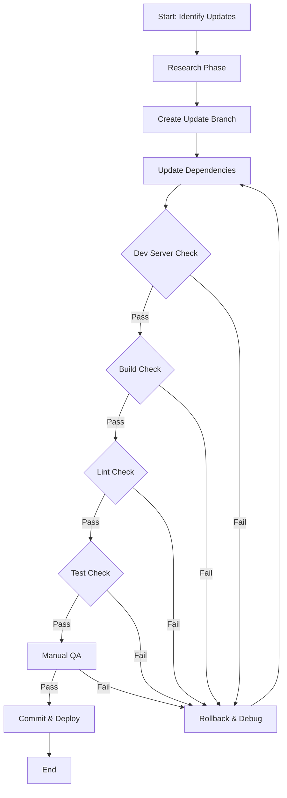
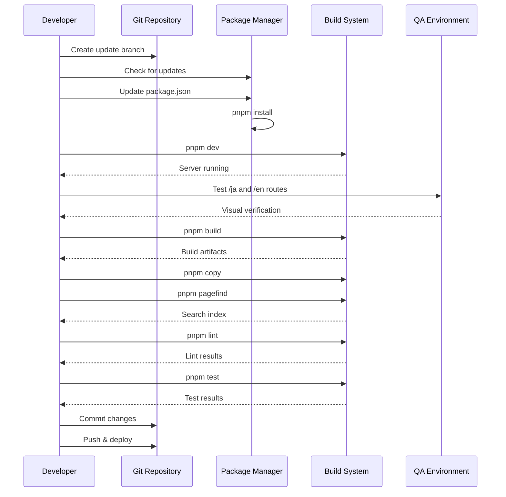

# Design Document: Library Update Process

## Overview

This design establishes a systematic, safe workflow for updating dependencies in a Next.js 15 + Nextra 4 profile website. The process emphasizes verification at each step to prevent breaking changes, with clear rollback strategies and reference to the upstream template repository. The workflow is designed to be repeatable and minimize risk when updating critical dependencies like Next.js, React, Nextra, Tailwind CSS, and other core libraries.

The update process follows a staged approach: research and planning, isolated updates with verification, comprehensive testing, and deployment validation. Each stage includes specific checkpoints to catch issues early before they propagate to production.

## Architecture



## Update Workflow Sequence




## Components and Interfaces

### Component 1: Update Planner

**Purpose**: Identifies available updates and assesses risk levels

**Interface**:
```typescript
interface UpdatePlanner {
  checkUpdates(): Promise<UpdateReport>
  assessRisk(updates: PackageUpdate[]): RiskAssessment
  checkUpstreamTemplate(): Promise<TemplateComparison>
}

interface UpdateReport {
  packages: PackageUpdate[]
  breakingChanges: BreakingChange[]
  securityFixes: SecurityFix[]
}

interface PackageUpdate {
  name: string
  currentVersion: string
  latestVersion: string
  type: 'major' | 'minor' | 'patch'
  changelog: string
}

interface RiskAssessment {
  level: 'low' | 'medium' | 'high' | 'critical'
  dependencies: string[]
  recommendations: string[]
}
```

**Responsibilities**:
- Query npm registry for available updates
- Parse package.json and pnpm-lock.yaml
- Compare with upstream template repository
- Categorize updates by semantic versioning
- Identify breaking changes from changelogs

### Component 2: Verification Engine

**Purpose**: Executes verification checks at each stage

**Interface**:
```typescript
interface VerificationEngine {
  runDevServer(): Promise<DevServerResult>
  runBuild(): Promise<BuildResult>
  runLint(): Promise<LintResult>
  runTests(): Promise<TestResult>
  verifyRoutes(routes: string[]): Promise<RouteVerification>
}

interface DevServerResult {
  success: boolean
  port: number
  errors: Error[]
  warnings: Warning[]
}

interface BuildResult {
  success: boolean
  outputPath: string
  artifacts: string[]
  errors: Error[]
  buildTime: number
}

interface RouteVerification {
  route: string
  status: number
  renderTime: number
  errors: Error[]
}
```

**Responsibilities**:
- Start and monitor development server
- Execute build process and capture output
- Run linting with proper configuration
- Execute test suites
- Verify critical routes render correctly


### Component 3: Rollback Manager

**Purpose**: Handles rollback operations when updates fail

**Interface**:
```typescript
interface RollbackManager {
  createCheckpoint(): Promise<Checkpoint>
  rollback(checkpoint: Checkpoint): Promise<void>
  cleanupCheckpoints(): Promise<void>
}

interface Checkpoint {
  id: string
  timestamp: Date
  packageJson: string
  lockfile: string
  gitCommit: string
}
```

**Responsibilities**:
- Create snapshots before updates
- Restore previous state on failure
- Maintain checkpoint history
- Clean up old checkpoints

## Data Models

### Model 1: PackageUpdatePlan

```typescript
interface PackageUpdatePlan {
  id: string
  createdAt: Date
  packages: PackageUpdate[]
  riskLevel: 'low' | 'medium' | 'high' | 'critical'
  strategy: UpdateStrategy
  verificationSteps: VerificationStep[]
  rollbackPlan: RollbackPlan
}

interface UpdateStrategy {
  type: 'individual' | 'batch' | 'grouped'
  order: string[]
  dependencies: Record<string, string[]>
}

interface VerificationStep {
  name: string
  command: string
  expectedResult: string
  timeout: number
  required: boolean
}

interface RollbackPlan {
  checkpointId: string
  steps: string[]
  estimatedTime: number
}
```

**Validation Rules**:
- id must be unique UUID
- packages array must not be empty
- Each package must have valid semver versions
- verificationSteps must include at least dev server and build checks
- rollbackPlan must reference valid checkpoint

### Model 2: VerificationReport

```typescript
interface VerificationReport {
  timestamp: Date
  updatePlanId: string
  steps: StepResult[]
  overallStatus: 'passed' | 'failed' | 'warning'
  duration: number
  errors: Error[]
  warnings: Warning[]
}

interface StepResult {
  step: string
  status: 'passed' | 'failed' | 'skipped'
  duration: number
  output: string
  errors: Error[]
}
```

**Validation Rules**:
- timestamp must be valid ISO date
- updatePlanId must reference existing plan
- steps array must match plan's verificationSteps
- duration must be positive number
- overallStatus derived from step results


## Algorithmic Pseudocode

### Main Update Workflow Algorithm

```pascal
ALGORITHM executeUpdateWorkflow(packages)
INPUT: packages - array of PackageUpdate objects
OUTPUT: result - VerificationReport

PRECONDITIONS:
  - packages is non-empty array
  - Git working directory is clean
  - All packages have valid semver versions
  - pnpm is installed and accessible

POSTCONDITIONS:
  - If successful: packages are updated and verified
  - If failed: system is rolled back to checkpoint
  - Verification report is generated
  - Git branch state is consistent

BEGIN
  // Step 1: Create safety checkpoint
  checkpoint ← createCheckpoint()
  ASSERT checkpoint.gitCommit IS NOT NULL
  
  // Step 2: Create update branch
  branchName ← "update/" + generateTimestamp()
  executeCommand("git checkout -b " + branchName)
  
  // Step 3: Update packages
  FOR each package IN packages DO
    updatePackageJson(package.name, package.latestVersion)
  END FOR
  
  // Step 4: Install dependencies
  installResult ← executeCommand("pnpm install")
  IF installResult.exitCode ≠ 0 THEN
    rollback(checkpoint)
    RETURN createFailureReport("Installation failed", installResult.errors)
  END IF
  
  // Step 5: Run verification pipeline
  verificationSteps ← [
    {name: "dev-server", command: "pnpm dev", timeout: 30000},
    {name: "build", command: "pnpm build", timeout: 300000},
    {name: "copy", command: "pnpm copy", timeout: 10000},
    {name: "pagefind", command: "pnpm pagefind", timeout: 60000},
    {name: "lint", command: "pnpm lint", timeout: 60000},
    {name: "test", command: "pnpm test", timeout: 120000}
  ]
  
  report ← initializeReport()
  
  FOR each step IN verificationSteps DO
    ASSERT report.steps.length = index of current step
    
    stepResult ← executeVerificationStep(step)
    report.steps.add(stepResult)
    
    IF stepResult.status = "failed" THEN
      report.overallStatus ← "failed"
      rollback(checkpoint)
      RETURN report
    END IF
  END FOR
  
  // Step 6: Manual QA verification
  DISPLAY "Please verify routes:"
  DISPLAY "  - http://localhost:3000/ja"
  DISPLAY "  - http://localhost:3000/en"
  
  manualApproval ← waitForUserInput()
  
  IF manualApproval = false THEN
    rollback(checkpoint)
    report.overallStatus ← "failed"
    report.errors.add("Manual QA failed")
    RETURN report
  END IF
  
  // Step 7: Commit changes
  executeCommand("git add package.json pnpm-lock.yaml")
  executeCommand("git commit -m 'chore: update dependencies'")
  
  report.overallStatus ← "passed"
  RETURN report
END
```


### Verification Step Execution Algorithm

```pascal
ALGORITHM executeVerificationStep(step)
INPUT: step - VerificationStep object
OUTPUT: result - StepResult object

PRECONDITIONS:
  - step.command is valid shell command
  - step.timeout is positive integer
  - Required tools (pnpm, node) are available

POSTCONDITIONS:
  - Command is executed or timeout occurs
  - Result contains status and output
  - No side effects on failure

BEGIN
  result ← {
    step: step.name,
    status: "skipped",
    duration: 0,
    output: "",
    errors: []
  }
  
  startTime ← getCurrentTime()
  
  // Special handling for dev server
  IF step.name = "dev-server" THEN
    process ← startBackgroundProcess(step.command)
    
    // Wait for server to be ready
    maxAttempts ← 30
    attempt ← 0
    
    WHILE attempt < maxAttempts DO
      ASSERT attempt < maxAttempts
      
      IF isPortOpen(3000) THEN
        // Verify routes
        jaRoute ← httpGet("http://localhost:3000/ja")
        enRoute ← httpGet("http://localhost:3000/en")
        
        IF jaRoute.status = 200 AND enRoute.status = 200 THEN
          result.status ← "passed"
          result.output ← "Dev server running, routes verified"
          stopProcess(process)
          result.duration ← getCurrentTime() - startTime
          RETURN result
        END IF
      END IF
      
      sleep(1000)
      attempt ← attempt + 1
    END WHILE
    
    result.status ← "failed"
    result.errors.add("Dev server failed to start or routes not accessible")
    stopProcess(process)
    result.duration ← getCurrentTime() - startTime
    RETURN result
  END IF
  
  // Standard command execution
  TRY
    output ← executeCommandWithTimeout(step.command, step.timeout)
    
    IF output.exitCode = 0 THEN
      result.status ← "passed"
      result.output ← output.stdout
    ELSE
      result.status ← "failed"
      result.errors.add(output.stderr)
    END IF
    
  CATCH TimeoutError
    result.status ← "failed"
    result.errors.add("Command timed out after " + step.timeout + "ms")
    
  CATCH ExecutionError as e
    result.status ← "failed"
    result.errors.add(e.message)
  END TRY
  
  result.duration ← getCurrentTime() - startTime
  RETURN result
END
```


### Upstream Template Comparison Algorithm

```pascal
ALGORITHM compareWithUpstreamTemplate()
INPUT: none
OUTPUT: comparison - TemplateComparison object

PRECONDITIONS:
  - Git repository is initialized
  - Network connection available
  - Upstream URL is valid

POSTCONDITIONS:
  - Comparison report generated
  - No local changes made
  - Upstream data cached

BEGIN
  upstreamUrl ← "https://github.com/pdsuwwz/nextjs-nextra-starter"
  
  // Fetch upstream package.json
  upstreamPackageJson ← fetchFile(upstreamUrl + "/raw/main/package.json")
  localPackageJson ← readFile("package.json")
  
  upstreamDeps ← parseJson(upstreamPackageJson).dependencies
  localDeps ← parseJson(localPackageJson).dependencies
  
  comparison ← {
    outdated: [],
    ahead: [],
    diverged: [],
    matching: []
  }
  
  // Compare dependencies
  FOR each package IN union(keys(upstreamDeps), keys(localDeps)) DO
    upstreamVersion ← upstreamDeps[package]
    localVersion ← localDeps[package]
    
    IF upstreamVersion IS NULL THEN
      comparison.ahead.add({
        package: package,
        localVersion: localVersion,
        note: "Not in upstream template"
      })
    ELSE IF localVersion IS NULL THEN
      comparison.outdated.add({
        package: package,
        upstreamVersion: upstreamVersion,
        note: "Missing from local"
      })
    ELSE IF semverCompare(localVersion, upstreamVersion) < 0 THEN
      comparison.outdated.add({
        package: package,
        localVersion: localVersion,
        upstreamVersion: upstreamVersion
      })
    ELSE IF semverCompare(localVersion, upstreamVersion) > 0 THEN
      comparison.ahead.add({
        package: package,
        localVersion: localVersion,
        upstreamVersion: upstreamVersion
      })
    ELSE IF localVersion ≠ upstreamVersion THEN
      comparison.diverged.add({
        package: package,
        localVersion: localVersion,
        upstreamVersion: upstreamVersion
      })
    ELSE
      comparison.matching.add(package)
    END IF
  END FOR
  
  RETURN comparison
END
```


## Key Functions with Formal Specifications

### Function 1: createCheckpoint()

```typescript
function createCheckpoint(): Promise<Checkpoint>
```

**Preconditions:**
- Git repository is initialized
- Working directory has no uncommitted changes (or changes are stashed)
- package.json and pnpm-lock.yaml exist

**Postconditions:**
- Returns valid Checkpoint object with unique ID
- Checkpoint contains snapshots of package.json and pnpm-lock.yaml
- Git commit hash is recorded
- Checkpoint is stored for potential rollback
- No modifications to working directory

**Loop Invariants:** N/A

### Function 2: rollback()

```typescript
function rollback(checkpoint: Checkpoint): Promise<void>
```

**Preconditions:**
- checkpoint is valid Checkpoint object
- checkpoint.gitCommit exists in repository
- checkpoint.packageJson and checkpoint.lockfile are valid JSON

**Postconditions:**
- Working directory restored to checkpoint state
- package.json matches checkpoint.packageJson
- pnpm-lock.yaml matches checkpoint.lockfile
- Git HEAD points to checkpoint.gitCommit
- node_modules regenerated via pnpm install
- System is in consistent, working state

**Loop Invariants:** N/A

### Function 3: verifyRoutes()

```typescript
function verifyRoutes(routes: string[]): Promise<RouteVerification[]>
```

**Preconditions:**
- routes is non-empty array of valid URLs
- Development server is running on localhost:3000
- Server has completed initialization

**Postconditions:**
- Returns array of RouteVerification objects, one per route
- Each verification includes HTTP status code
- Each verification includes render time
- All routes are tested regardless of individual failures
- No side effects on server state

**Loop Invariants:**
- For each iteration: all previously tested routes have verification results
- Number of results equals number of iterations completed


### Function 4: updatePackageJson()

```typescript
function updatePackageJson(packageName: string, version: string): void
```

**Preconditions:**
- packageName is non-empty string
- version is valid semver string
- package.json exists and is valid JSON
- packageName exists in dependencies or devDependencies

**Postconditions:**
- package.json is updated with new version
- File is written with proper formatting (2-space indent)
- Only specified package version is modified
- Other package.json fields remain unchanged
- File is valid JSON after modification

**Loop Invariants:** N/A

## Example Usage

### Example 1: Update Single Package (Tailwind CSS)

```typescript
// Step 1: Check current version and available updates
const planner = new UpdatePlanner()
const updates = await planner.checkUpdates()
const tailwindUpdate = updates.packages.find(p => p.name === 'tailwindcss')

console.log(`Current: ${tailwindUpdate.currentVersion}`)
console.log(`Latest: ${tailwindUpdate.latestVersion}`)

// Step 2: Assess risk
const risk = planner.assessRisk([tailwindUpdate])
console.log(`Risk level: ${risk.level}`)

// Step 3: Create update plan
const plan: PackageUpdatePlan = {
  id: uuid(),
  createdAt: new Date(),
  packages: [tailwindUpdate],
  riskLevel: risk.level,
  strategy: { type: 'individual', order: ['tailwindcss'], dependencies: {} },
  verificationSteps: [
    { name: 'dev-server', command: 'pnpm dev', expectedResult: 'Server running', timeout: 30000, required: true },
    { name: 'build', command: 'pnpm build', expectedResult: 'Build successful', timeout: 300000, required: true },
    { name: 'lint', command: 'pnpm lint', expectedResult: 'No errors', timeout: 60000, required: true }
  ],
  rollbackPlan: { checkpointId: '', steps: [], estimatedTime: 60 }
}

// Step 4: Execute update
const result = await executeUpdateWorkflow(plan.packages)

if (result.overallStatus === 'passed') {
  console.log('Update successful!')
} else {
  console.error('Update failed:', result.errors)
}
```


### Example 2: Batch Update with Grouped Dependencies

```typescript
// Update Next.js and React together (they must be compatible)
const planner = new UpdatePlanner()
const updates = await planner.checkUpdates()

const nextjsUpdate = updates.packages.find(p => p.name === 'next')
const reactUpdate = updates.packages.find(p => p.name === 'react')
const reactDomUpdate = updates.packages.find(p => p.name === 'react-dom')

const plan: PackageUpdatePlan = {
  id: uuid(),
  createdAt: new Date(),
  packages: [nextjsUpdate, reactUpdate, reactDomUpdate],
  riskLevel: 'high',
  strategy: {
    type: 'grouped',
    order: ['react', 'react-dom', 'next'],
    dependencies: {
      'next': ['react', 'react-dom']
    }
  },
  verificationSteps: [
    { name: 'dev-server', command: 'pnpm dev', expectedResult: 'Server running', timeout: 30000, required: true },
    { name: 'build', command: 'pnpm build', expectedResult: 'Build successful', timeout: 300000, required: true },
    { name: 'copy', command: 'pnpm copy', expectedResult: 'Files copied', timeout: 10000, required: true },
    { name: 'pagefind', command: 'pnpm pagefind', expectedResult: 'Index created', timeout: 60000, required: true },
    { name: 'lint', command: 'pnpm lint', expectedResult: 'No errors', timeout: 60000, required: true },
    { name: 'test', command: 'pnpm test', expectedResult: 'All tests pass', timeout: 120000, required: true }
  ],
  rollbackPlan: { checkpointId: '', steps: [], estimatedTime: 120 }
}

const result = await executeUpdateWorkflow(plan.packages)
```

### Example 3: Compare with Upstream Template

```typescript
// Check what's different from the original template
const comparison = await compareWithUpstreamTemplate()

console.log('Packages behind upstream:')
comparison.outdated.forEach(pkg => {
  console.log(`  ${pkg.package}: ${pkg.localVersion} → ${pkg.upstreamVersion}`)
})

console.log('\nPackages ahead of upstream:')
comparison.ahead.forEach(pkg => {
  console.log(`  ${pkg.package}: ${pkg.localVersion} (upstream: ${pkg.upstreamVersion})`)
})

console.log('\nDiverged packages:')
comparison.diverged.forEach(pkg => {
  console.log(`  ${pkg.package}: local=${pkg.localVersion}, upstream=${pkg.upstreamVersion}`)
})
```


## Correctness Properties

### Property 1: Atomicity of Updates
**∀ update ∈ UpdateWorkflow**: (update.status = 'passed' ⟹ all packages updated) ∧ (update.status = 'failed' ⟹ system rolled back to checkpoint)

The update process is atomic - either all packages are successfully updated and verified, or the system is completely rolled back to the pre-update state.

### Property 2: Verification Completeness
**∀ plan ∈ PackageUpdatePlan**: plan.verificationSteps includes {dev-server, build, lint} as minimum required steps

Every update plan must include at least the three critical verification steps: development server check, production build, and linting.

### Property 3: Checkpoint Validity
**∀ checkpoint ∈ Checkpoint**: checkpoint.gitCommit exists in repository ∧ checkpoint.packageJson is valid JSON ∧ checkpoint.lockfile is valid YAML

All checkpoints must reference valid git commits and contain parseable package files.

### Property 4: Route Verification Coverage
**∀ verification ∈ RouteVerification**: verification.routes includes ['/ja', '/en']

Route verification must always test both language versions of the site.

### Property 5: Rollback Idempotency
**∀ checkpoint ∈ Checkpoint**: rollback(checkpoint) ⟹ rollback(checkpoint) produces same state

Rolling back to the same checkpoint multiple times produces identical results.

### Property 6: Version Consistency
**∀ package ∈ UpdatedPackages**: semver.valid(package.version) ∧ package.version in pnpm-lock.yaml

All updated packages must have valid semantic versions that match the lockfile.

### Property 7: Build Artifact Completeness
**∀ build ∈ BuildResult**: build.success = true ⟹ exists('out/index.html') ∧ exists('out/_pagefind')

Successful builds must produce the expected output directory structure with search index.

### Property 8: Dependency Graph Consistency
**∀ plan ∈ PackageUpdatePlan**: plan.strategy.type = 'grouped' ⟹ dependencies updated before dependents

When updating grouped packages, dependencies must be updated before packages that depend on them.


## Error Handling

### Error Scenario 1: Installation Failure

**Condition**: pnpm install fails due to dependency conflicts or network issues

**Response**: 
- Capture full error output from pnpm
- Parse error message to identify conflicting packages
- Log error details to verification report
- Immediately trigger rollback to checkpoint

**Recovery**:
- Restore package.json and pnpm-lock.yaml from checkpoint
- Run pnpm install to restore node_modules
- Verify restoration by running pnpm dev
- Provide user with conflict resolution suggestions

### Error Scenario 2: Build Failure

**Condition**: pnpm build fails due to TypeScript errors, missing dependencies, or configuration issues

**Response**:
- Capture build output and error stack traces
- Identify failing files and error types
- Check if errors are related to updated packages
- Log detailed error information

**Recovery**:
- Rollback to checkpoint
- Suggest incremental update strategy (update packages one at a time)
- Provide links to package changelogs for breaking changes
- Recommend checking upstream template for configuration changes

### Error Scenario 3: Development Server Startup Failure

**Condition**: Dev server fails to start or routes return errors

**Response**:
- Capture server startup logs
- Test port availability (check if 3000 is already in use)
- Attempt to access routes and capture HTTP errors
- Record timeout or connection errors

**Recovery**:
- Kill any hanging processes on port 3000
- Rollback to checkpoint
- Verify checkpoint state works correctly
- Suggest checking for port conflicts or environment issues

### Error Scenario 4: Lint Failures

**Condition**: ESLint reports errors after update

**Response**:
- Capture all lint errors with file locations
- Categorize errors (syntax, style, type errors)
- Determine if errors are from updated packages or existing code
- Check if ESLint configuration needs updates

**Recovery**:
- If errors are from new ESLint rules: suggest configuration updates
- If errors are from breaking changes: rollback and plan incremental fixes
- Provide option to continue with warnings (non-blocking)
- Generate report of required code changes


### Error Scenario 5: Test Failures

**Condition**: Jest tests fail after package updates

**Response**:
- Run tests with verbose output
- Capture failing test names and error messages
- Identify if failures are from updated packages (e.g., testing library changes)
- Check for breaking API changes in dependencies

**Recovery**:
- Analyze if test failures indicate real bugs or test updates needed
- If real bugs: rollback immediately
- If test updates needed: document required changes
- Provide option to update tests before committing

### Error Scenario 6: Pagefind Index Generation Failure

**Condition**: pnpm pagefind fails to generate search index

**Response**:
- Verify build output exists in expected location
- Check if HTML files are properly formatted
- Capture pagefind error output
- Verify pagefind binary is accessible

**Recovery**:
- Check if build output path changed
- Verify next.config.ts output settings
- Rollback if critical, or mark as warning if search is non-critical
- Suggest manual pagefind configuration review

### Error Scenario 7: Route Verification Failure

**Condition**: /ja or /en routes return 404 or 500 errors

**Response**:
- Capture HTTP response status and body
- Check if Next.js routing configuration changed
- Verify i18n middleware is functioning
- Test if static files are generated correctly

**Recovery**:
- Rollback to checkpoint
- Compare next.config.ts with upstream template
- Check for breaking changes in Next.js i18n handling
- Verify middleware.ts is compatible with new Next.js version

### Error Scenario 8: Git Conflict During Rollback

**Condition**: Rollback fails due to uncommitted changes or merge conflicts

**Response**:
- Stash any uncommitted changes
- Record stash reference for later recovery
- Force checkout to checkpoint commit
- Log conflict details

**Recovery**:
- Use git reset --hard to checkpoint commit
- Restore package files from checkpoint snapshots
- Re-run pnpm install
- Provide user with stash reference to recover any work


## Testing Strategy

### Unit Testing Approach

Unit tests focus on individual functions and components of the update workflow:

**Test Coverage Goals:**
- UpdatePlanner: checkUpdates(), assessRisk(), checkUpstreamTemplate()
- VerificationEngine: All verification methods
- RollbackManager: createCheckpoint(), rollback()
- Utility functions: updatePackageJson(), semver comparison

**Key Test Cases:**
1. Package version parsing and comparison
2. Checkpoint creation and restoration
3. Risk assessment logic for different update types
4. Error handling in each verification step
5. Git operations (branch creation, commit, rollback)

**Testing Tools:**
- Jest for test runner
- Mock filesystem operations for package.json manipulation
- Mock child_process for command execution
- Mock HTTP requests for upstream template fetching

### Property-Based Testing Approach

Property-based tests verify invariants hold across many generated inputs:

**Property Test Library**: fast-check (already in devDependencies)

**Properties to Test:**

1. **Rollback Idempotency**: Rolling back to same checkpoint multiple times produces identical state
   ```typescript
   fc.assert(fc.property(fc.checkpoint(), (checkpoint) => {
     const state1 = rollback(checkpoint)
     const state2 = rollback(checkpoint)
     return deepEqual(state1, state2)
   }))
   ```

2. **Version Ordering Consistency**: Semver comparison is transitive
   ```typescript
   fc.assert(fc.property(fc.semver(), fc.semver(), fc.semver(), (a, b, c) => {
     if (compare(a, b) < 0 && compare(b, c) < 0) {
       return compare(a, c) < 0
     }
     return true
   }))
   ```

3. **Checkpoint Validity**: All created checkpoints are valid and restorable
   ```typescript
   fc.assert(fc.property(fc.packageState(), async (state) => {
     const checkpoint = await createCheckpoint()
     return isValidCheckpoint(checkpoint) && canRestore(checkpoint)
   }))
   ```

4. **Update Plan Validation**: Generated update plans always include required verification steps
   ```typescript
   fc.assert(fc.property(fc.packageUpdateArray(), (packages) => {
     const plan = createUpdatePlan(packages)
     return plan.verificationSteps.some(s => s.name === 'dev-server') &&
            plan.verificationSteps.some(s => s.name === 'build')
   }))
   ```

### Integration Testing Approach

Integration tests verify the complete workflow in a controlled environment:

**Test Environment Setup:**
- Create temporary git repository
- Initialize with sample package.json and pnpm-lock.yaml
- Mock external services (npm registry, upstream template)
- Use test fixtures for known package versions

**Integration Test Scenarios:**

1. **Complete Update Workflow**: Execute full update from planning to verification
2. **Rollback on Build Failure**: Verify system restores correctly when build fails
3. **Multi-Package Update**: Test grouped dependency updates
4. **Upstream Template Sync**: Compare with template and apply updates
5. **Manual QA Rejection**: Verify rollback when user rejects changes

**Test Execution:**
- Run in isolated environment (Docker container or CI)
- Use actual pnpm commands (not mocked)
- Verify file system state after each step
- Check git history is correct


## Performance Considerations

### Build Time Optimization

**Challenge**: Full build and verification can take 5-10 minutes for large updates

**Strategies:**
- Cache node_modules between verification steps when possible
- Use pnpm's built-in caching for faster installs
- Run lint and test in parallel after build succeeds
- Skip redundant builds when only devDependencies change
- Use incremental TypeScript compilation

**Metrics to Track:**
- Total workflow execution time
- Individual verification step duration
- pnpm install time
- Build time comparison before/after updates

### Network Efficiency

**Challenge**: Fetching package metadata and upstream template data

**Strategies:**
- Cache npm registry responses for 1 hour
- Use pnpm's offline mode when possible
- Batch package metadata requests
- Cache upstream template comparison results
- Use conditional requests (If-Modified-Since headers)

### Resource Management

**Challenge**: Multiple concurrent processes (dev server, build, tests)

**Strategies:**
- Properly terminate dev server after verification
- Clean up temporary files and checkpoints
- Limit concurrent command execution
- Monitor memory usage during builds
- Use streaming for large log outputs

### Verification Optimization

**Challenge**: Route verification can be slow with many routes

**Strategies:**
- Test only critical routes (/ja, /en) by default
- Provide option for comprehensive route testing
- Use HTTP keep-alive for multiple route checks
- Implement timeout for slow-responding routes
- Cache successful route verifications


## Security Considerations

### Dependency Security

**Threat**: Malicious packages or compromised dependencies

**Mitigations:**
- Check for security advisories before updating (pnpm audit)
- Verify package signatures and checksums
- Review changelog for suspicious changes
- Use lockfile to ensure reproducible installs
- Monitor for unexpected dependency additions

**Implementation:**
```typescript
async function checkSecurityAdvisories(packages: PackageUpdate[]): Promise<SecurityReport> {
  const auditResult = await exec('pnpm audit --json')
  const advisories = JSON.parse(auditResult.stdout)
  
  return {
    vulnerabilities: advisories.vulnerabilities,
    affectedPackages: packages.filter(p => 
      advisories.vulnerabilities.some(v => v.name === p.name)
    ),
    recommendations: generateSecurityRecommendations(advisories)
  }
}
```

### Rollback Security

**Threat**: Rollback to compromised state or exposure of sensitive data

**Mitigations:**
- Verify checkpoint integrity before rollback
- Never commit sensitive data in checkpoints
- Use git history for audit trail
- Encrypt checkpoint data if stored externally
- Validate restored state before proceeding

### Command Injection

**Threat**: Malicious input in package names or versions

**Mitigations:**
- Validate all package names against npm naming rules
- Sanitize version strings (must match semver pattern)
- Use parameterized commands instead of string concatenation
- Whitelist allowed characters in user input
- Escape shell special characters

**Example:**
```typescript
function sanitizePackageName(name: string): string {
  // npm package names: lowercase, hyphens, @scope/name
  const validPattern = /^(@[a-z0-9-~][a-z0-9-._~]*\/)?[a-z0-9-~][a-z0-9-._~]*$/
  if (!validPattern.test(name)) {
    throw new Error(`Invalid package name: ${name}`)
  }
  return name
}

function sanitizeVersion(version: string): string {
  if (!semver.valid(version)) {
    throw new Error(`Invalid version: ${version}`)
  }
  return version
}
```

### Access Control

**Threat**: Unauthorized updates or malicious configuration changes

**Mitigations:**
- Require manual approval for high-risk updates
- Log all update attempts with timestamps
- Verify git user identity before commits
- Require code review for major version updates
- Implement rate limiting for automated updates


## Dependencies

### Core Dependencies (Already Installed)

**Package Manager:**
- pnpm 10.6.3+ - Fast, disk-efficient package manager

**Runtime:**
- Node.js 18+ - JavaScript runtime
- TypeScript 5.8+ - Type checking and compilation

**Build Tools:**
- Next.js 15.2.4 - React framework with App Router
- Nextra 4.2.16 - MDX content engine
- Tailwind CSS 4.2.0 - Utility-first CSS framework
- PostCSS 8.5.6 - CSS processing

**Testing:**
- Jest 30.2.0 - Test runner
- fast-check 4.5.3 - Property-based testing
- @testing-library/react 16.3.2 - React component testing
- @testing-library/jest-dom 6.9.1 - DOM matchers

**Linting:**
- ESLint 9.21.0 - JavaScript/TypeScript linter
- @antfu/eslint-config 4.5.1 - ESLint configuration

**Build Utilities:**
- pagefind 1.4.0 - Static search index generator
- cpy-cli 5.0.0 - File copying utility
- cross-env 7.0.3 - Cross-platform environment variables

### External Services

**npm Registry:**
- Purpose: Fetch package metadata and versions
- API: https://registry.npmjs.org
- Rate limits: Consider caching responses

**Upstream Template Repository:**
- URL: https://github.com/pdsuwwz/nextjs-nextra-starter
- Purpose: Compare local packages with template baseline
- Access: Public GitHub repository (no authentication required)

**GitHub API (Optional):**
- Purpose: Fetch release notes and changelogs
- API: https://api.github.com
- Rate limits: 60 requests/hour unauthenticated, 5000 with token

### Development Tools

**Git:**
- Version: 2.0+
- Purpose: Version control, branching, rollback
- Required commands: checkout, commit, reset, stash

**Shell:**
- Unix-like shell (bash, zsh) or Windows PowerShell
- Purpose: Execute pnpm commands and scripts
- Required for: Command execution, process management

### Optional Dependencies

**Notification Services:**
- Slack/Discord webhooks for update notifications
- Email service for critical failure alerts

**Monitoring:**
- Application monitoring for production deployments
- Error tracking (Sentry, etc.) for build failures

**CI/CD:**
- GitHub Actions for automated update checks
- Dependabot for security updates


## Reference: Tailwind CSS Update Example

This section documents the Tailwind CSS 3 → 4 update as a reference implementation of the workflow.

### Update Details

**Package**: tailwindcss  
**Version Change**: 3.x → 4.2.0  
**Risk Level**: High (major version, breaking changes)  
**Related Packages**: @tailwindcss/postcss 4.0.10

### Breaking Changes Encountered

1. **Configuration Format**: tailwind.config.ts structure changed
2. **PostCSS Plugin**: Required @tailwindcss/postcss package
3. **CSS Import**: Changed from `@tailwind` directives to `@import`
4. **Plugin API**: Some plugins required updates

### Verification Steps Executed

```bash
# 1. Update package.json
pnpm add tailwindcss@4.2.0 @tailwindcss/postcss@4.0.10

# 2. Update configuration files
# - Modified tailwind.config.ts
# - Updated postcss.config.mjs

# 3. Update CSS imports
# - Changed global CSS files to use @import

# 4. Development server verification
pnpm dev
# Verified: http://localhost:3000/ja ✓
# Verified: http://localhost:3000/en ✓

# 5. Production build
pnpm build
# Output: .next/server/app ✓

# 6. Copy index file
pnpm copy
# Output: out/index.html ✓

# 7. Generate search index
pnpm pagefind
# Output: out/_pagefind ✓

# 8. Lint check
pnpm lint
# Result: No errors ✓

# 9. Test suite
pnpm test
# Result: All tests passed ✓
```

### Issues Encountered and Resolutions

**Issue 1**: CSS not loading in development
- **Cause**: Missing @tailwindcss/postcss plugin
- **Resolution**: Added plugin to postcss.config.mjs

**Issue 2**: Build warnings about deprecated features
- **Cause**: Old @tailwind directives in CSS
- **Resolution**: Replaced with @import statements

**Issue 3**: Custom theme colors not working
- **Cause**: Theme configuration syntax changed
- **Resolution**: Updated tailwind.config.ts with new syntax

### Lessons Learned

1. **Read Migration Guides**: Tailwind 4 had comprehensive migration documentation
2. **Update Related Packages**: PostCSS plugin was required dependency
3. **Test Both Languages**: Ensured /ja and /en routes both worked
4. **Check Build Output**: Verified static export structure unchanged
5. **Verify Search**: Confirmed pagefind still worked with new CSS

### Time Investment

- Research and planning: 30 minutes
- Implementation: 45 minutes
- Testing and verification: 30 minutes
- Total: ~2 hours

### Commit Message

```
chore: update Tailwind CSS to v4.2.0

- Update tailwindcss to 4.2.0
- Add @tailwindcss/postcss plugin
- Update configuration for v4 syntax
- Replace @tailwind directives with @import
- Verify all routes and build process

Breaking changes handled:
- New PostCSS plugin required
- Configuration format updated
- CSS import syntax changed

Tested:
✓ Dev server (ja/en routes)
✓ Production build
✓ Search index generation
✓ Linting
✓ Test suite
```

