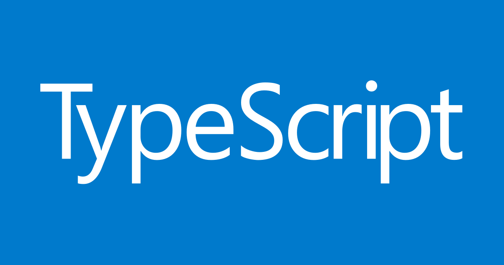

# Tegebu TS勉強会で登壇しました
Typescriptのセキュアなランタイム、**Deno**について話をしました   

## 10 Things I Regret About Node.js
JSConf EU 2018で、Node.js作者であるRyan Dahl ※ライアン・ダールが発表した内容。  
日本語にすると、「Node.jsについて後悔する10のこと」。  
Denoの公表を含んでいました。  

※ regretの直訳は色々ある  
- 後悔
- 反省点
- 設計ミス

## 続きは
後日全てを公開します。  
（tsxで埋め込みする予定）
