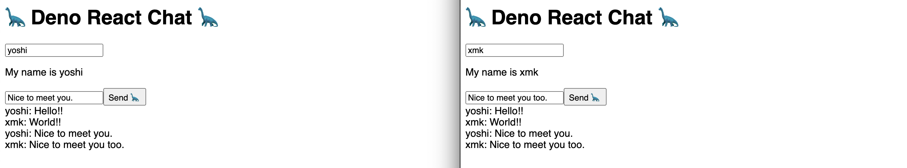
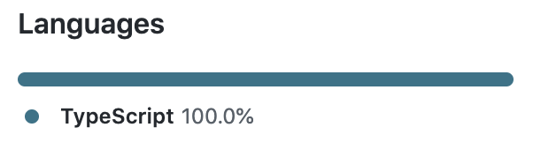

# deno-react-chatを公開しました

  Publication date： 2020-07-08

React, deno-react-base-server, Websocketを使用して、チャットを作成しました。  
リポジトリはこちら  
https://github.com/yoshixmk/deno-react-chat  
（ IssueやPRをお待ちしてます ）

React.FunctionComponent (React.FC) を使用しています  
また、Typescriptファイルのみで構成してみました。  

サーバは、[deno-react-base-server](https://github.com/asos-craigmorten/deno-react-base-server)を使用しており、背後で[Opine](https://github.com/asos-craigmorten/opine)という、ExpressJSから移植されたDeno用の高速でシンプルなWebフレームワークが動作します。  

Opineを使用して、1から作成したい場合は一度[Example](https://github.com/asos-craigmorten/opine/tree/main/examples/react)を見てみるのがおすすめです。  

Denoのランタイムで動作する、http server フレームワークは活動的で、ひしめいています。選定する際には、[What Is The Best Deno Web Framework?](https://dev.to/craigmorten/what-is-the-best-deno-web-framework-2k69) が参考になります。  
こちらは翻訳予定ですので、完了したらまた記事を書こうと思います。
