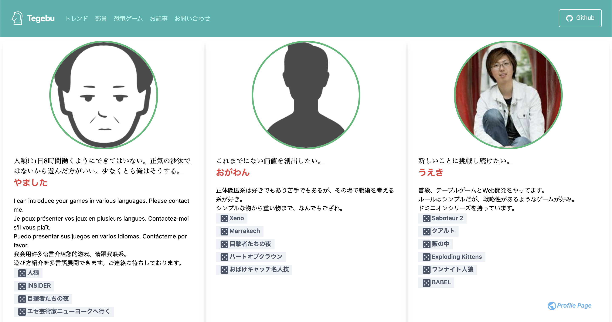
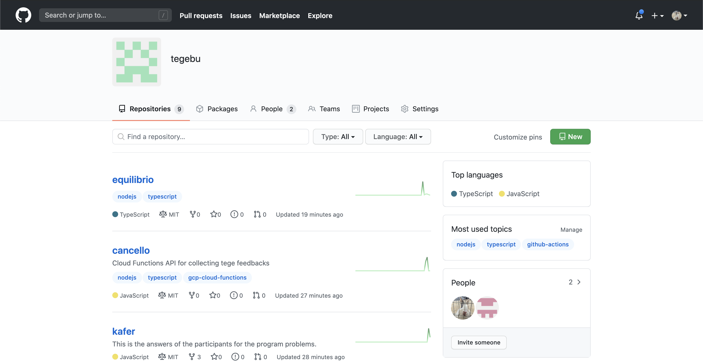

# てげメンバーの部員紹介ページを作成し、リリースしました

Publication date： 2020-08-17

## ドメインについて

今回のリリースは、今まで最も大きなリリースです。  
**ドメイン移行までのマイルストーンは全て完了**し、てげぶのドメインの移行が完了していることを報告します <https://www.tegebu.com/> 。

新サイトでは、私たちのテーブルゲームの紹介や、最新トレンドの動的更新、ページの整理整頓、外部リンクなどの見直しなど数えきれない変更を行ってきました。

以前の記事でも紹介していますが、新テーマは明るく仕上がっています（真っ暗なテーマに、さよなら😁）

これに伴い、[旧てげぶサイト](https://github.com/yoshixmk/tegebu)については、Archiveを行っています。およそ1年間使用していました。

## てげ部の部員ページについて  

部員ページはいわゆる、メンバーページにあたります。
今後も情報を部員更新する予定がありますので、お楽しみに！
<https://www.tegebu.com/members/>

## ホスティングの場所を変更
開発では、[Netlify](https://tegebu.netlify.app/)を使用していましたが、Github Actionsを使うことで、今後の開発がさらに行いやすいであろうことから、GIthub Pagesに移行しました （※ 現在もNetlifyへのデプロイ自体は行っています。）

## 開発について
開発において、最も大きなニュースは、[Organization](https://github.com/tegebu)へ全面的に移行し、てげぶのリポジトリの集約に努めたことが挙げられます。

開発に携わるのは、私（[@yoshixmk](https://github.com/yoshixmk)）と[@jamashita](https://github.com/jamashita)です。

我々は、いつも遊び心を持って開発してます。  

今回のリリースでも、あの有名な[恐竜ゲーム](https://www.tegebu.com/dinosaur/)をひっそり含めてみました。

また新しいニュースが届けられるように、今日もまたコミットを続けています。
テーブルゲーム、ボードゲームと、エンジニアリングを掛け合わせることにご興味がある方は、ぜひご連絡ください。

Mail: info@tegebu.com

Twitter: https://twitter.com/tegebu

